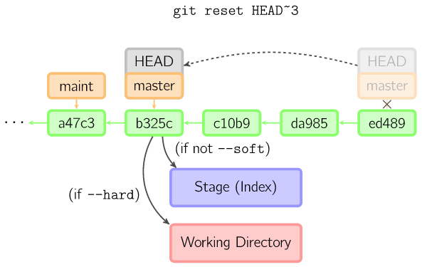

#git

个人觉得只要将下面的资源全部过一遍就可以很好理解和使用git了

[git reference](http://gitref.org/basic/#reset)

[git api and advanced use](http://git-scm.com/docs)

[git book](http://git-scm.com/book/en/v2)

[git tutorial](http://git-scm.com/docs/gittutorial)

比较推荐的git管理工具是sourceTree，原因是其既有图形化界面又有git命令行

## git common command description

### git cat-file

git cat-file -t <commit>，查看Git对象的类型，主要的git对象包括tree，commit，parent，和blob等。

git cat-file -p <commit>，查看Git对象的内容

### git log

git log主要用来显示分支中提交更改的记录。当执行git commit以存储一个快照的时候，文件详单、提交消息和提交者的信息、此次提交所基于的快照都会被保存。

git log --oneline，可以显示更加短小的提交ID.

git log --graph，显示何时出现了分支和合并等信息,也就是图形显示

git log --pretty=raw，显示提交对象的parent属性.

git log erlang ^master，查看只在erlang分支里的修改

git log --grep, 正则取一个log

### git config

git config -e

git config -e --global

git config -e --system

Git的三个配置文件分别是版本库级别的配置文件（/.git/config）、全局配置文件（用户主目录下）和系统级配置文件（/etc目录 下）。这个命令的作用是打开相应的配置文件，并且进行编辑。其中版本库级别的配置文件的优先级最高，全局配置文件次之，系统级别配置文件最低。Git配置 文件采用的是INI文件格式。

#### 在全局空间中添加新的用户

git config --global user.name "lili.tian"

git config --global user.email tianxuelihello@sina.cn

#### 设置git命令的别名

git config --global alias.ci commit

git config --global alias.co checkout

#### 删除git全局配置文件中的用户名

git config --unset --global user.name

git config --unset --global user.email

### git grep

git grep可以用来搜索工作区中的文件内容

要查找git仓库里某个特定版本里的内容, 我们可以像下面一样在命令行末尾加上标签名(tag reference)，git grep '文字内容' v1.0

### git diff

git diff，显示工作区和暂存区的差异

git diff HEAD，显示工作区和HEAD之间的差异

git diff --cached，显示暂存区和HEAD之间的差异

git diff id1 id2，显示两次提交之间的差异

### git status

git status，查看你的代码在缓存与当前工作目录的状态

git status -s，将结果以简短的形式输出

### git add

git add，在提交你修改的文件之前，你需要把它们添加到暂存区。如果该文件是新创建的，你可以执行将该文件添加到暂存区

git add . ，Git会递归地将你执行命令时所在的目录中的所有文件添加上去，所以如果你将当前的工作目录作为参数，它就会追踪那儿的所有文件

git add -u，使用-u参数调用了git add命令，会将本地有改动（包括删除和修改）的已经追踪的文件标记到暂存区中。

git add -A，使用-A参数会将添加所有改动的已跟踪文件和未跟踪文件。

git add -i，交互式的方式进行添加。

### git commit

git commit --amend，修补式提交。

git commit --a，对本地所有变更的文件执行提交操作，包括对本地修改的文件和删除的文件，但是不包括未被版本库跟踪的文件。但是这个命令最好不要使用，这样会丢掉Git暂存区带给用户的最大好处：对提交内容进行控制的能力

git commit --allow-empty，允许执行空白提交

### git reset

把当前分支指向另一个位置，并且有选择的变动工作目录和索引

git reset --hard <commit>，其中commit是可选项，可以使用引用或者提交ID，如果省略则相当于使用了HEAD的指向作为提交ID，完成的操作包括替换引用的指向，替换暂存区，替换工作区

git reset --soft <commit>，其中commit是可选项，可以使用引用或者提交ID，如果省略则相当于使用了HEAD的指向作为提交ID。完成的操作主要是更改引用的指向，不改变暂存区和工作区

git reset，等同于git reset HEAD，用HEAD指向的目录树重置暂存区

git reset -- filename，将文件filename的改动撤出暂存区，暂存区其他文件不变

git reset HEAD --filename 等同于git reset -- filename, 比如之前有add filename，此命令操作之后，filename将处于未被add的状态，也就是从index转变为working状态

reset的三个选项在此做一重复说明：
* --hard， 回退版本，代码也回退，忽略所有修改
* --soft， 回退版本，代码不变，回退所有的add操作
* --mixed， 回退版本，代码不变，保留add操作

### git branch

git branch，显示当前所在的分支

git branch <branchname>，创建新的分支branchname

git branch <branchname> <start-point>，基于提交<start-point>创建新分支，新分支的分支名为<branchname>

git branch -d <branchname> ，删除名称为branchname的分支，删除时会检查所有的删除分支是否已经合并到其他分支，否则拒绝删除

git branch -D <branchname>，强制删除分支<branchname>

git branch -m <oldbranch> <newbranch>，重命名分支

git branch -r , 查看远程分支

git checkout [branchName]， 切换分支

git checkout -b [branchName], 创建新分支并立即切换到新分支

git merge [branchName], 将名称为branchName的分支与当前分支合并

git push origin [branchName], 创建远程分支（本地分支push到远程）

git push origin : [branchName], 删除远程分支branchName

### git checkout

checkout命令用于从历史提交（或者暂存区域）中拷贝文件到工作目录，也可用于切换分支

git checkout branchname，会改变HEAD头指针，主要用于切换分支

git checkout -b branchname，用于创建一个新的分支，并且切换到创建的新的分支上

git checkout --filename，用暂存区中的filename文件来覆盖工作区中的filename文件

git checkout <commit> --filename，用指定提交中的文件覆盖暂存区和工作区中对应的文件

git checkout -- .或者git checkout .，用暂存区的所有文件直接覆盖本地文件，取消所有的本地的修改，是一条危险的操作

看一个git checkout HEAD~ files的图例：

如果既没有指定文件名，也没有指定分支名，而是一个标签、远程分支、SHA-1值或者是像master~3类似的东西，就得到一个匿名分支，称作detached HEAD（被分离的HEAD标识）。这样可以很方便地在历史版本之间互相切换。比如说你想要编译1.6.6.1版本的git，你可以运行git checkout v1.6.6.1（这是一个标签，而非分支名），编译，安装，然后切换回另一个分支，比如说git checkout master。然而，当提交操作涉及到“分离的HEAD”时，其行为会略有不同

#### HEAD标识处于分离状态时的提交操作

当HEAD处于分离状态（不依附于任一分支）时，提交操作可以正常进行，但是不会更新任何已命名的分支。(你可以认为这是在更新一个匿名分支。)

一旦此后你切换到别的分支，比如说master，那么这个提交节点（可能）再也不会被引用到，然后就会被丢弃掉了。注意这个命令之后就不会有东西引用2eecb。

但是，如果你想保存这个状态，可以用命令git checkout -b name来创建一个新的分支。

### git clean

删除本地多余的目录和文件

git clean -nd，显示要删除的内容，但是是预删除

git clean -fd，强制删除多余的文件和目录

### git rm

rm命令删除的文件只是在本地进行了删除，尚未添加到暂存区，也就是说，直接在工作区删除，对暂存区和版本库没有任何影响。

git rm命令会将删除动作加入暂存区，这是执行提交动作，就从真正意义上执行了文件删除。

git rm file --cached，只从暂存区移除，保存本地的文件

### git mv

git mv，移动文件，git中以git rm和git add两条命令取而代之。

### git archive

git archive，对任意提交对应的目录树建立归档。

git archive -o latest.zip HEAD，基于最新提交建立归档文件latest.zip

git archive -o partial.tar HEAD src doc，只将目录src和doc建立到归档文件partial.tar中

git archive --format=tar --prefix=1.0/ v1.0 | gzip > foo-1.0.tar.gz，基于里程碑v1.0建立归档，并且为归档中的文件添加目录前缀1.0

### git clone

git clone <repository> <directory>，将repository指向的版本库创建一个克隆到directory目录中。目录directory相当于克隆版 本库的工作区，文件都会检出，版本库位于工作区下得.git目录中。

git clone --bare <repository> <directory.git>

git clone --mirror <repository> <directory.git>

上面的两种克隆版本都不包含工作区，直接就是版本库的内容，这样的版本库称为裸版本库。

### git push

git push <remote> [branch]，就会将你的 [branch] 分支推送成为 [alias] 远端上的 [branch] 分支，要推送的远程版本号的URL地址由remote.<remote>.pushurl给出，如果没有配置，则使用 remote.<remote>.url配置的URL地址。

如果想把本地的某个分支test提交到远程仓库，并作为远程仓库的master分支，或者作为另外一个名叫test的分支，如下：

$git push origin test:master // 提交本地test分支作为远程的master分支 

$git push origin test:test // 提交本地test分支作为远程的test分支

### git pull

git pull，从远端的服务器上下载数据，从而实现同步更新。要获取的远程版本库的URL地址由remote.<remote>.url提供。

### git stash

将当前未提交的工作存入Git工作栈中，时机成熟的时候再应用回来

git stash clear, 清空stash堆栈

### git tag

git tag , 查看标签

git tag [name], 创建标签

git tag -d [name], 删除标签

git tag -r, 查看远程标签

git push origin [tagname] ,创建远程标签(本地push到远程)

git push origin :refs/tags/[name]， 删除远程标签

git pull origin --tags ，合并远程的标签到本地

git push origin --tags，上传本地tag到远程仓库

git tag -a [name] -m 'your message', 创建带注释的tag

### 子模块相关操作命令

$ git submodule add [url] [path], 添加子模块, 如：
$ git submodule add git://github.com/soberh/ui-libs.git src/main/webapp/ui-libs

初始化子模块：$ git submodule init —-只在首次检出仓库时运行一次就行 

更新子模块：$ git submodule update —-每次更新或切换分支后都需要运行一下

删除子模块：（分4步走哦） 

* $ git rm –cached [path] 
* 编辑“.gitmodules”文件，将子模块的相关配置节点删除掉 
* 编辑“ .git/config”文件，将子模块的相关配置节点删除掉 
* 手动删除子模块残留的目录

### cherry-pick

cherry-pick命令“复制”一个提交节点并在当前分支做一次完全一样的新提交

### rebase

衍合是合并命令的另一种选择。合并把两个父分支合并进行一次提交，提交历史不是线性的。衍合在当前分支上重演另一个分支的历史，提交历史是线性的。本质上，这是线性化的自动的 cherry-pick

上面的命令都在topic分支中进行，而不是master分支，在master分支上重演，并且把分支指向新的节点。注意旧提交没有被引用，将被回收。

要限制回滚范围，使用--onto选项。下面的命令在master分支上重演当前分支从169a6以来的最近几个提交，即2c33a。

